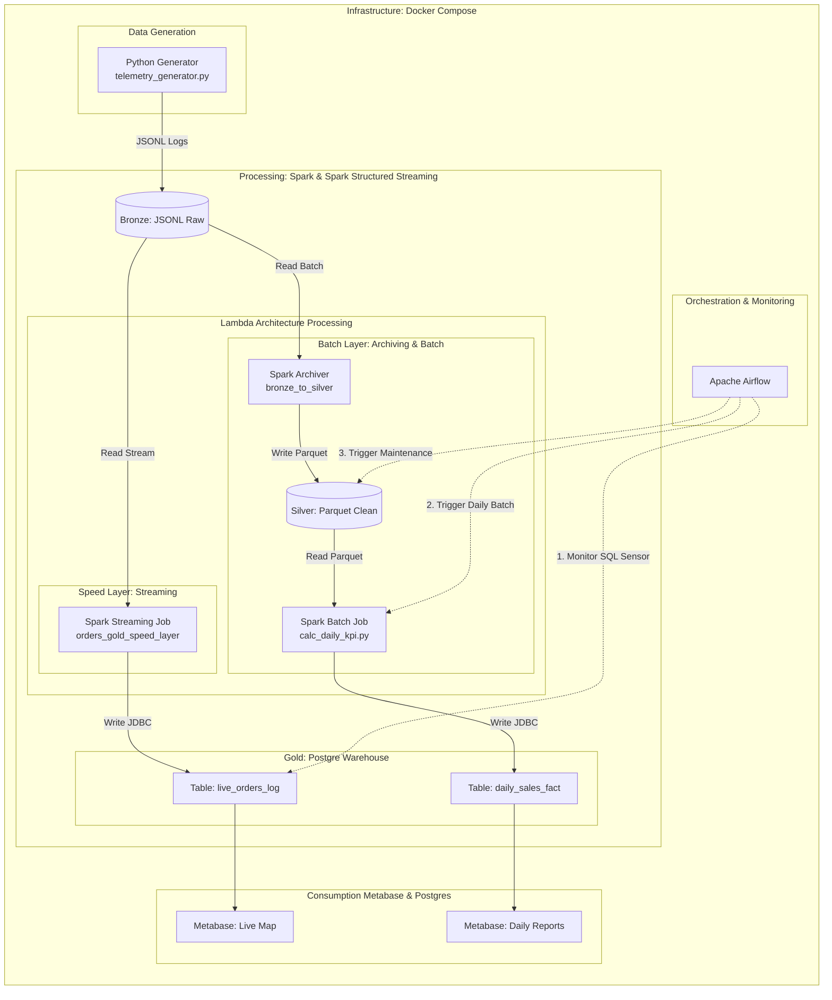
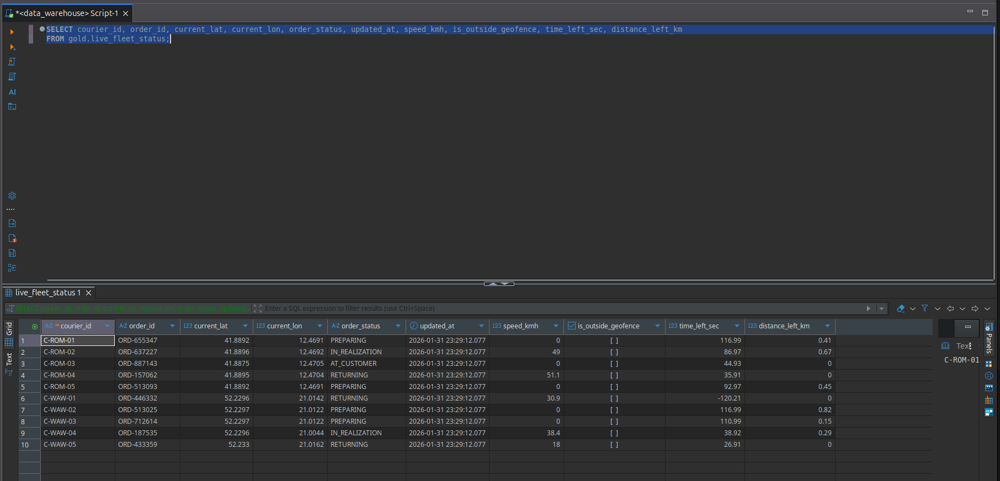
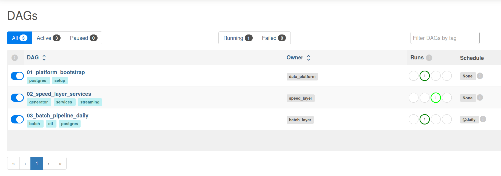
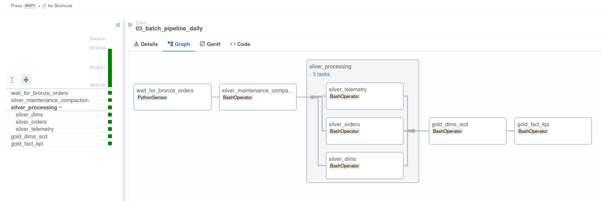

# Pizza Delivery OLAP Data Pipeline

## Project Overview

An end-to-end data engineering project designed to transform high-volume logistics data into an **OLAP Data Warehouse**. The pipeline implements a Medallion Architecture (Bronze/Silver/Gold) and a Lambda Architecture pattern to support both real-time operational dashboards and historical analytical reporting.

## Tech Stack

* **Processing:** Apache Spark (PySpark), Structured Streaming
* **OLAP Warehouse:** PostgreSQL (Star Schema)
* **Orchestration:** Custom Python Orchestrator (Local Demo) / Apache Airflow (Production)
* **Infrastructure:** Docker, Docker Compose
* **Modeling:** Star Schema, SCD Type 2 (Slowly Changing Dimensions)

## Architecture & Data Flow

* **1. Ingestion (Bronze):** Synthetic data generator produces raw JSON/CSV logs into the landing zone (`data/bronze`).
* **2. Processing (Silver):** PySpark jobs perform cleaning, deduplication, schema enforcement, and partitioning. Data is stored in Parquet format.
* **3. Warehousing (Gold):** Processed data is loaded into **PostgreSQL** as an OLAP Star Schema, optimized for complex analytical queries using JDBC.

## System Architecture

The platform follows a **Medallion Architecture** (Bronze -> Silver -> Gold) integrated within a **Lambda Architecture** framework.



### Data Processing Flow details

* **1. Bronze Layer (Raw Ingestion)**
  * **Role:** Landing zone for immutable, raw data.
  * **Format:** JSON (Streaming), CSV (Static).
* **2. Silver Layer (Enriched & Optimized)**
  * **Role:** Data cleaning, type enforcement, and structural optimization.
  * **Engine:** Apache Spark (PySpark).
* **3. Gold Layer (OLAP & Business Logic)**
  * **Role:** Serving layer for analytics.
  * **Engine:** PostgreSQL.
  * **Hybrid Processing:** Batch Sequence (Dimensions) + Speed Layer (Live Facts).

## Key Technical Features

### 1. OLAP Dimensional Modeling

* **Star Schema:** Defined in `models/gold_schema_md.sql`.
* **SCD Type 2:** Handles history tracking for courier profiles (e.g., vehicle changes, risk factors) ensuring historical accuracy in reporting. Implemented in `gld_btch_dims_load.py`.



### 2. Lambda Architecture

* **Batch Layer:** Ensures consistency and completeness by reloading Dimensions and recalculating KPI aggregates.
* **Speed Layer:** `gld_live_*.py` scripts provide low-latency ingestion for real-time fleet tracking and order status updates directly into the Warehouse.

### 3. Orchestration & Stability

* **Custom Orchestrator:** A Python-based runner (`scripts/orchestrator.py`) manages the dependency chain: Batch Init -> Streaming Services.
* **Airflow:** Production-ready DAGs for daily processing.





### 4. Analytics & Reporting

Real-time operational dashboards served via Metabase.


## Repository Structure

```text
├── data/                   # Local storage for Data Lake (Parquet/JSON)
│   ├── bronze/             # Raw landing zone
│   ├── silver/             # Cleaned & Partitioned Parquet
│   ├── gold/               # Processed files for Gold
│   └── checkpoints/        # Spark Structured Streaming Checkpoints
├── docs/                   # Documentation & Screenshots
│   └── img/
├── models/
│   └── gold_schema_md.sql  # DDL for PostgreSQL Data Warehouse
├── orchestration/dags/     # Airflow DAGs
├── scripts/                # Utility scripts for running the demo
│   ├── linux/              # .sh scripts (run_demo, clean_state)
│   ├── windows/            # .bat scripts (run_demo, clean_state)
│   └── orchestrator.py     # Main Python process manager
├── secrets/                # DB Passwords (git-ignored)
├── src/
│   ├── generator/          # Synthetic Data Generator
│   │   └── gen_telemetry.py
│   └── pipelines/          # Spark Jobs
│       ├── silver/
│       │   ├── slv_btch_dims_load.py   # Batch: Load Dimensions to Silver
│       │   └── ...
│       └── gold/
│           ├── gld_btch_dims_load.py       # Batch: Load/SCD2 to Postgres
│           ├── gld_live_fleet.py           # Stream: Real-time Fleet Status
│           ├── gld_live_orders.py          # Stream: Real-time Orders
│           └── gld_speed_layer_fact_perf.py # Stream: Fact Table Ingestion
├── docker-compose.yml
├── Dockerfile
└── Makefile
```

## Quick Start

### Prerequisites

* Docker & Docker Compose
* Python 3.8+ (for local scripts)

### 1. Initialize Project & Secrets

Create folders and set up passwords for Postgres.

```bash
make init
# Follow the prompts to set passwords
```

### 2. Start Infrastructure

```bash
make up
```

### 3. Deploy Data Warehouse Schema

```bash
make setup-gold
```

### 4. Run the Pipeline Demo

This starts the Orchestrator (Batch -> Streaming).

**Linux / WSL:**

```bash
scripts/linux/run_demo.sh
```

**Windows:**

```batch
scripts\windows\run_demo.bat
```

### 5. Reset Environment

```bash
scripts/linux/clean_state.sh  # Linux
scripts\windows\clean_state.bat # Windows
```
