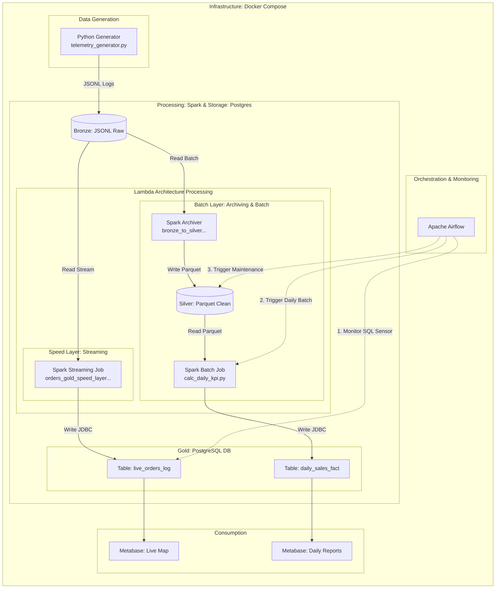

Data Architecture: Pizza Delivery Analytics
1. Architecture Overview

This project implements an end-to-end data pipeline based on the Medallion Architecture. It is designed to track the full lifecycle of pizza orders and analyze courier telemetry in real-time (Last-Mile Analytics).

The platform leverages DuckDB as a high-performance OLAP engine, with Apache Airflow managing orchestration within a Docker-containerized environment.
2. High-Level Diagram

3. Data Layers (Medallion)
Bronze (Raw)

    Objective: Immutable data ingestion.

    Data: Raw JSON events from the Order API and IoT GPS telemetry streams.

    Tech Stack: DuckDB (Ingestion to internal tables/Parquet).

Silver (Refined)

    Objective: Cleaning, deduplication, and telemetry aggregation.

    Processes: * Joining state events (e.g., Order Placed matched with Order Picked Up).

        Converting raw GPS pings into path segments.

        Standardizing customer data and delivery addresses.

Gold (Curated / Star Schema)

    Objective: Analytical modeling for business intelligence and ML.

    Model: Star Schema centered around the fact_order_performance table.

    Logic: * Implementation of SCD Type 2 for dim_courier and dim_pizzeria to maintain historical accuracy.

        Advanced telemetry metrics (Variance Pct, Average Speed, Geofencing).

4. Key Design Decisions
DuckDB as the Analytical Core

Chosen for its vectorized execution engine and native support for Parquet and JSON. DuckDB provides enterprise-grade OLAP performance with zero administrative overhead (In-process OLAP), making it ideal for modern, portable data stacks.
Apache Airflow (The Orchestrator)

Acts as the Control Plane of the architecture:

    Trigger Ingestion: Orchestrates the timing of data extraction from external sources.

    Dependency Management: Ensures the Gold layer is only recalculated upon the successful completion of Silver transformations.

    Retries & Monitoring: Handles transient API failures automatically.

Last-Mile Telemetry Logic

The model addresses specific logistics challenges:

    Distance Variance: Compares the theoretical shortest path with the actual route taken by the courier.

    Geofencing: Detects when a courier deviates significantly from the optimal delivery zone (is_outside_geofence).

5. Data Integrity & Constraints

    Granularity: Each row in the fact table represents a single unique order.

    Temporal Consistency: All timestamps are standardized to UTC.

    Referential Integrity: Enforced between the Fact table and all Dimensions to ensure report accuracy.